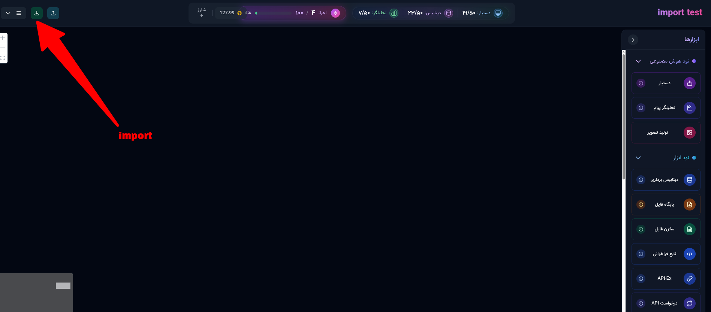

# Workflow Template

## Overview
The `delaverseAI/workflow-template` repository provides JSON-based workflow templates designed to simplify and standardize process automation. These reusable configurations support seamless setup and execution across various workflows.

## Contents
- **JSON Templates**: Each file defines a workflow with preconfigured tasks, triggers, and actions.
- **Schema**: Templates adhere to a consistent, well-documented structure for easy integration and customization.
- **Examples**: Includes sample templates for common scenarios like Sales Data Analysis, Server and Database Monitoring and so on.

## Getting Started
1. **Select a Template**: Browse the JSON files to find a suitable workflow template.
2. **Import to Your Project**:
   - Download the desired JSON file.
   - In your project, locate the "Import" button (see screenshot below) and upload the JSON file.
     
3. **Customize**: Modify the template as needed to fit your project requirements.
4. **Run**: Integrate the template into your workflow engine or automation tool.

## Contributing
We welcome contributions! To contribute:
1. Fork this repository.
2. Create a new branch: `git checkout -b feature-branch`.
3. Add or update JSON templates.
4. Commit changes: `git commit -m "Add/update workflow template"`.
5. Push to your fork: `git push origin feature-branch`.
6. Submit a pull request for review.

## License
This project is licensed under the MIT License. See the [LICENSE](LICENSE) file for details.

## Contact
For questions, suggestions, or issues, please open a GitHub issue or reach out to the maintainers at [delaverseAI](https://github.com/delaverseAI).

© 2025 delaverseAI
